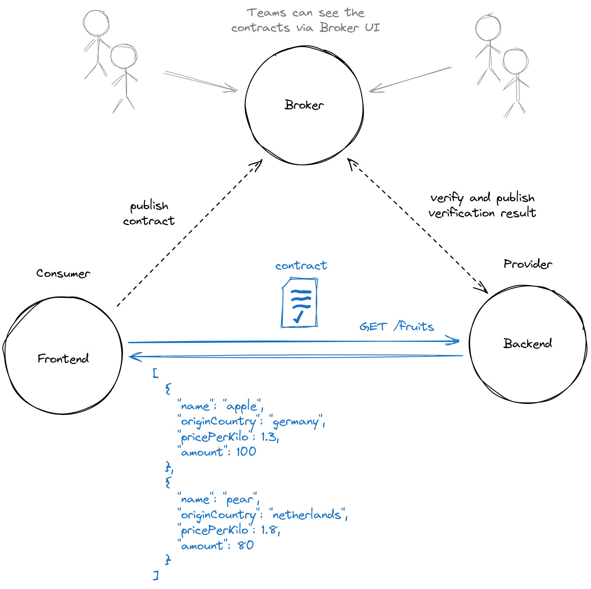
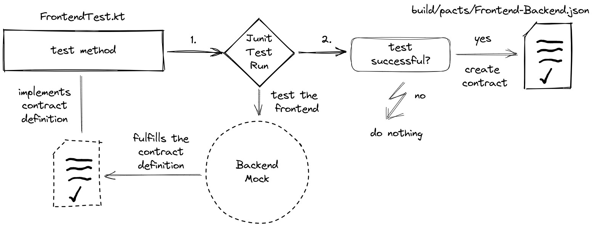
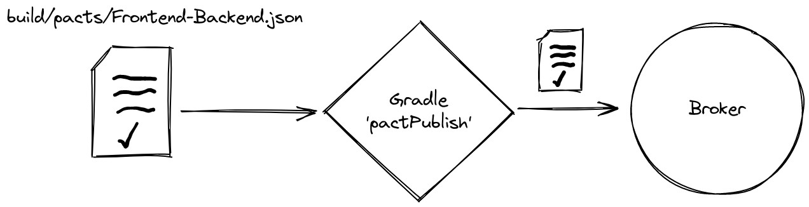
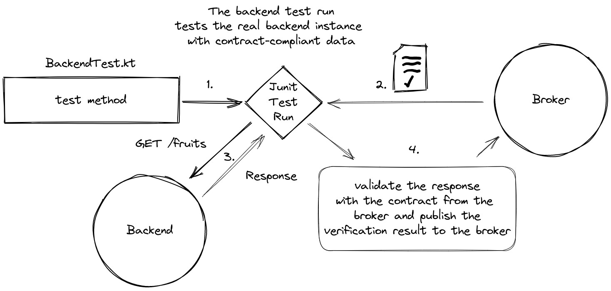

# Consumer Driven Contract Testing with Pact.io

The following scenario is implemented here.



The term **contract** is synonymous with **pact**.

The _frontend_ as a consumer has a contract with the _backend_ as a provider
and a contract broker (pact broker) is used as the exchange and documentation place.
The frontend requests fruits and the backend responds with a (never empty) list of fruits.
The important thing with CDC is, that the tests are focusing on the exact definitions of both,
the request and the response.

In general, the following applies to CDC: 
The contract covers only the communication between two participants, 
describing requests and responses. No functional testing is applied.
The consumer defines the exact request it will make and the exact response it wants to receive.
This forms the contract.
The provider then gets the contract and verifies that it fulfills the contract.


# Prerequisites

- Java (Version >=17)
- Docker Compose V2 to run the Pact Broker


# Get started


## Start the broker

Start the pact broker (`docker-compose.yml`) and then access it via http://localhost.

```shell
  docker compose up
  ```


## Create and publish the contract


### Create

The consumers CDC test creates the contract file
`consumer/build/pacts/Frontend-Backend.json` at runtime.
So, we only need to run the test,
easily by building the consumer project via gradle.
Building via gradle is enough, because the gradle `build` task also 
calls the gradle `test` task.

```shell
consumer/gradlew -p consumer build
```


The Frontend CDC test does the following:

- it defines the contract
- tests the Frontend against a contract-compliant mock provider
- and if the test passed, it creates the contract file


### Publish 

The pact.io gradle plugin publishes the contract to the broker.

```shell
consumer/gradlew -p consumer pactPublish
```



## Build and verify the provider

As mentioned above, the gradle `build` task also calls the `test` task.
Verifying the provider means calling its CDC test.
Thus, building the provider will also test (verify) it.
And due to our configuration, the verification result is 
immediately published to the broker.

```shell
provider/gradlew -p provider build
```




## Can I deploy?

By calling the _Can I Deploy_ gradle task,
the provider team can explicitly ensure once again that it can deploy
the provider without breaking the consumer.

```shell
provider/gradlew -p provider canideploy -P pacticipant='Backend' -P latest=true
```


# A few notes about CDC


## Teams have to talk to each other

As can be seen here, CDC aims, among other things,
to ensure that the contractual partners,
i.e. the consumer team and the provider team, talk to each other.
CDC brings people to the table.


## Contracts

- Tests should have a very small scope
- Only the communication itself is of interest
- Responses may have extra fields, but requests may not
- You can make use of [provider states](https://docs.pact.io/getting_started/provider_states)
- Use [helpful versioning](https://docs.pact.io/getting_started/versioning_in_the_pact_broker#best-practices)


# References
- [Pact](https://.pact.io)
- [Writing Consumer Tests](https://docs.pact.io/consumer)
- [Code With Engineering Playbook about CDC Testing](https://microsoft.github.io/code-with-engineering-playbook/automated-testing/cdc-testing/)